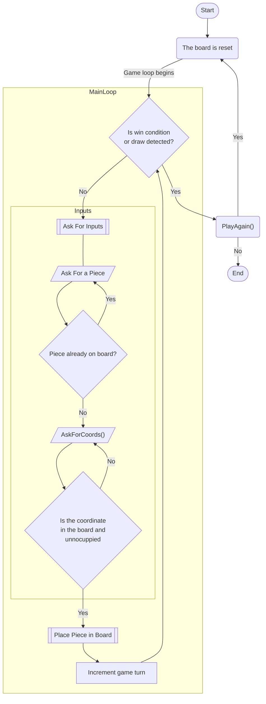

# Galo da Velha

## Autoria

Trabalho realizado por:
- Afonso Cunha - a22302960
  - Responsável por:
    - Maior parte do código da Classe Piece;
- Júlia Costa - a22304403
  - Responsável por:
    - Parte do código da Classe Piece;
    - Código da Classe GameBoard;
    - Documentação das Classes GameBoard e Piece;

[URL para o repositório Git](https://github.com/Juhhxx/GaloDaVelha_LP1)

## Arquitetura da solução

### Descrição

Para este projeto, escolhemos dividi-lo em 3 classes diferentes e ainda duas enumerações (não contando com o ficheiro Program):

1. **Class GameManager**
   - Responsável "gerir" o jogo onde pertencem os métodos:
      - **GameSetup()** - estabelece as condições referentes ao estado zero do jogo;
      - **PlayAgain()** - imprime no ecrã a questão se o jogador que rjogar outra vez
      - **GameStart()** - chama o GameSetup() e inicia o game loop, onde se chama o AskForInputs() e, após vitória chama o PlayAgain();
2. **Class Piece**
     - Responsável por funções associadas à instanciação de peças assim como as suas características:
       - **InitializePiece()** - inicializa o código de uma peça e vrific se a peça é válida;
       - **Decode(string code)** - recebendo uma string do código correspondente a uma peça, configura os traits da instância da classe Piece com recurso à Enum PieceTraits, retornando o código Enum que representa esta instância;
       - **InArray(string piece)** - recebendo uma string (obtida através do GetTrait()) que contem os traits da peça, verifica se essa "peça" está já registada no array que tem como objetivo guardar um log das peças instanciadas, retorna um booleano;
       - **SetName()** - usando um array tridimensional, categoriza cada peça de acordo com os seus traits (exceto a cor) e atribui-lhe um unicode correspondente ao símbolo que representará a peça;
       - **SetColor()** - verifica se o código da peça contém o Enum color ativo, ditando com que cor o símbolo da peça vai ser impresso no ecrã (magenta para "light" e vermelho para "dark");
       - **GetTrait()** - constroi e retorna uma string que contem os vários traits da instancia da peça;
       - **GetInArray()** - por definir
       - **GetName()** - retorna o caracter Unicode que representará a peça;
       - **GetColor()** - retorna um ConsoleColor, referente à  cor da peça;
       - **CheckForTrait(PieceTraits trait, string res1, string res2)** - verifica se a trait (e.x big) nessa peça está ativa ou não, se a trait tiver ativa, devolve a string correspondente ao trait ativo ("big") e s tiver iantivo devolve a string para o trait inativo ("tiny");
       - **ResetPiecesArray()** - manda reset ao array que regista as peças criadas deixando-o "vazio" e pronto para um novo jogo;
3. **Class GameBoard**
    - Reponsável pela interface e ações de jogadores assim como verificação de estado do jogo:
      - **AskForInputs()** - chama os métoos AskForPiece() e AskForCoords() e insere a peça na matriz tabuleiro;
      - **WhoPlays()** - responsávl por verificar quem é que seleciona a peça a colocar pelo outro jogador naquele turno;
      - **AskForPiece()** - pede pelo input de um código de traits correspondente a uma peça que o jogador quer que o outro jogador coloque futuramente, retorna a peça desejada pelo utilizador;
      - **AskForCoords()** - pede pelo input de coordenadas do tabuleiro (e.x "A3) onde o jogador deseja colocar a peça, retorna um array de inteiros correspondentes às coordenadas desejadas;
      - **CheckCoordInRange(string coord)** - recebe a string correspondente às coordenadas onde o jogador deseja colocar a peça e verifica se essas coordenadas existem no tabuleiro, retornando um booleano;
      - **CoordIsEmpty(int[] coord)** - recebe um array com inteiros correspondentes às coordenadas onde o jogador deseja colocar a peça e verifica se esse espaço já está ocupado por outra peça, retorna um booleano;
      - **PrintBoard()** - imprime o tabuleiro na consola;
      - **ColoredText(string str, ConsoleColor color)** - imprime uma string coma  cor especificada; 
      - **CheckXWin(int x, int y, int traitCheck)** - usa as coordenadas da última pça colocada e retorna true se verificar uma condição de vitória naquela linha,  caso contrário retorna false;
      - **CheckYWin(int x, int y, int traitCheck)** - usa as coordenadas da última pça colocada e retorna true se verificar uma condição de vitória naquela coluna,  caso contrário retorna false;
      - **CheckDiagonalPosWin(int x, int y, int traitCheck)** - retorna true se se verificar uma condição de vitória na diagonal A1 - D4, caso contrário retorna false;
      - **CheckDiagonalNegWin(int x, int y, int traitCheck)** - retorna true se se verificar uma condição de vitória na diagonal D1 - A4, caso contrário retorna false;
      - **CheckForGameWin(int[] lastCoords)** - Chama cada um dos 4 métodos CheckWin e retorna um booleano onde true é significa que alguém ganhou o jogo e false significa que não foi verificada nenhuma condição de vitória; 
4. **Enum PieceTraits**
    - Enumeração bit a bit que contém os vários tipos de traits que uma peça pode ter;
5. **Enum XCoords**
    - Enumeração que contém uma correspondência entre letras (A,B,C,D) e valores inteiros (1,2,3,4 correspondentemente) de forma a numerar o eixo horizontal do tabuleiro, perservando uma nomenclatura clássica vista em vários tabuleiros;

### Fluxograma

## Referências

Neste projeto recorreu-se apenas a [esta biblioteca de códigos Unicode](https://symbl.cc/en/). Tirando esta referência, não foram realizadas trocas de ideias com colegas nem foram utilizados pedaços de código gerado por IAs generativas ou outros pedaçoes de código aberto ou bibliotecas de terceiros.